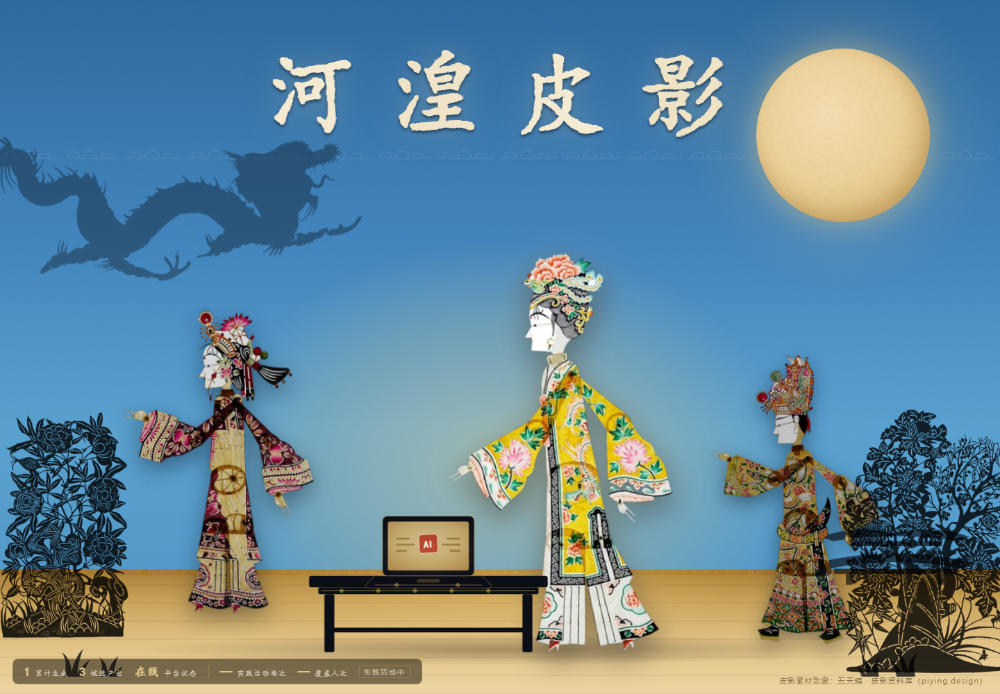
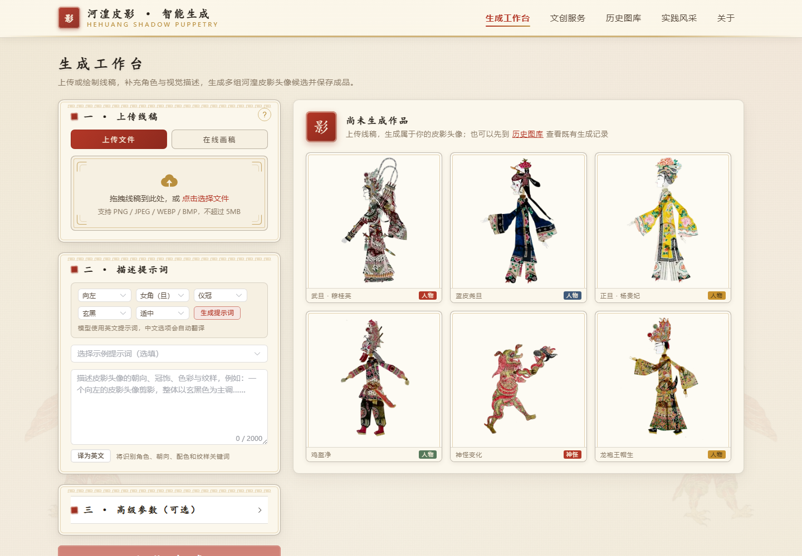
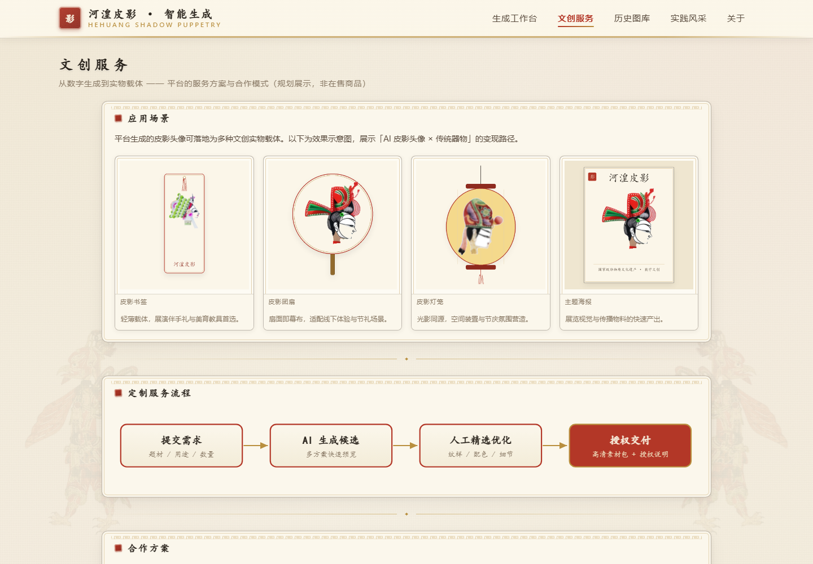

# 影脉相承 | Hehuang Shadow Puppet Generation Platform

> 面向河湟皮影数字创作的 AIGC Web 平台：从线稿上传或在线绘制出发，完成提示词编辑、生成任务管理、候选预览、成品下载与历史归档。



## 项目亮点

- 面向非遗数字创作设计完整交互流程，而不是单页模型演示
- 支持线稿拖拽上传、鼠标/触屏在线画板，以及可选轮廓参考图
- 提供中文描述助手、示例提示词和英文提示词编辑
- 使用 FastAPI 后端、串行任务队列和状态轮询管理耗时生成任务
- 支持多候选预览、逐候选相似度评分、推荐结果、高清下载和分享卡生成
- 使用 SQLite 保存任务状态、参数与历史记录
- 前端采用 Vue 3、Vite 与 Element Plus，兼顾桌面端和移动端
- 通过统一 Provider 接口连接私有生成服务，便于替换部署环境

## 页面预览

| 生成工作台 | 文创应用 |
| --- | --- |
|  |  |

## 仓库范围

这个仓库是用于作品展示的 Web 平台工程，包含前端、业务 API、任务队列、历史归档和生成服务适配层。

生产环境使用的生成引擎、训练代码、模型权重和训练数据不在本仓库中。平台通过受保护的 HTTP 服务调用生成能力，避免将模型资产与产品层代码耦合。仓库自带 `mock` Provider，仅用于界面联调和流程演示，不代表生产生成效果。

平台层的输入、候选展示、评分展示和推荐结果均通过统一接口传递；生成服务的内部实现由部署端管理。

## 技术栈

- Frontend: Vue 3, Vite, Element Plus, Axios
- Backend: FastAPI, Pydantic, Pillow, HTTPX
- Storage: SQLite
- Delivery: Vite static build served by FastAPI

## 快速开始

### 1. 安装后端依赖

```powershell
python -m venv .venv
.\.venv\Scripts\Activate.ps1
pip install -r requirements.txt
```

### 2. 构建前端

```powershell
cd webapp\frontend
npm install
npm run build
cd ..\..
```

### 3. 启动演示模式

```powershell
$env:PUPPET_PROVIDER_MODE="mock"
python -m webapp.backend.app
```

浏览器访问 `http://127.0.0.1:8000/`。演示模式会生成风格化占位预览和演示评分，用于验证上传、排队、候选展示和历史记录流程；这些评分不代表生产模型效果。

### 4. 连接私有生成服务

```powershell
$env:PUPPET_PROVIDER_MODE="remote"
$env:PUPPET_GENERATION_API_URL="https://your-private-service.example/generate"
$env:PUPPET_GENERATION_API_KEY="replace-with-your-secret"
python -m webapp.backend.app
```

完整环境变量见 [.env.example](.env.example)。请勿把密钥提交到 Git。

## 主要 API

| Method | Path | Purpose |
| --- | --- | --- |
| `POST` | `/api/generate` | 提交线稿与生成参数 |
| `GET` | `/api/tasks/{task_id}` | 查询任务状态和结果 |
| `GET` | `/api/history` | 分页读取历史任务 |
| `GET` | `/api/history/{task_id}` | 查看任务详情 |
| `GET` | `/api/health` | 检查平台与 Provider 状态 |
| `GET` | `/api/stats` | 获取平台生成统计 |

## 项目结构

```text
.
├── docs/
│   └── screenshots/           # 作品集页面截图
├── webapp/
│   ├── backend/
│   │   ├── app.py             # FastAPI 路由与静态站点托管
│   │   ├── provider.py        # 私有生成服务适配层
│   │   ├── tasks.py           # 串行任务队列
│   │   ├── db.py              # SQLite 历史归档
│   │   └── schemas.py         # API 数据模型
│   └── frontend/
│       ├── src/               # Vue 页面、组件与主题
│       └── dist/              # 前端构建产物
├── .env.example
└── requirements.txt
```

## 说明

- 所有页面中的人物与文创效果图仅用于非遗数字创作展示。
- 皮影装饰素材来源与授权信息见 [素材致谢](webapp/frontend/src/assets/showcase/CREDITS.md)。
- Web 平台代码采用 MIT License；外部素材仍遵循各自授权条款。
